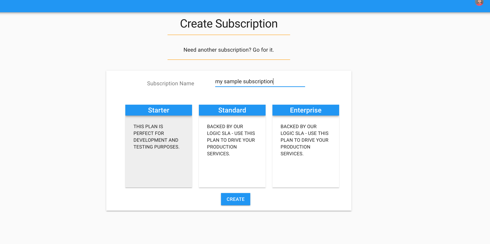
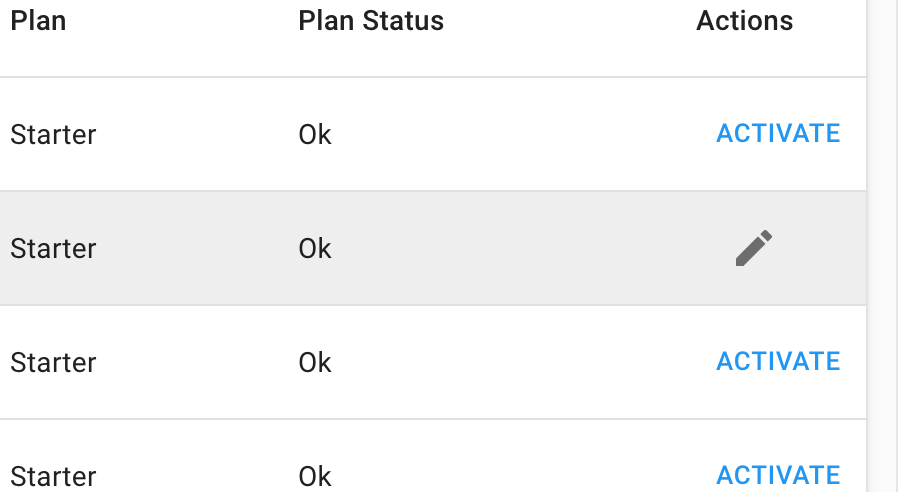
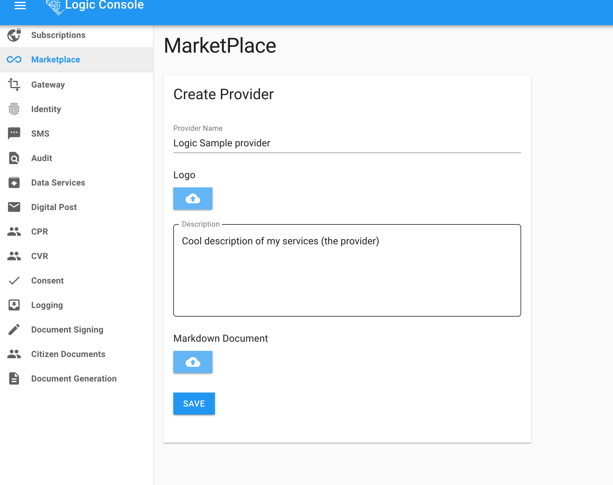
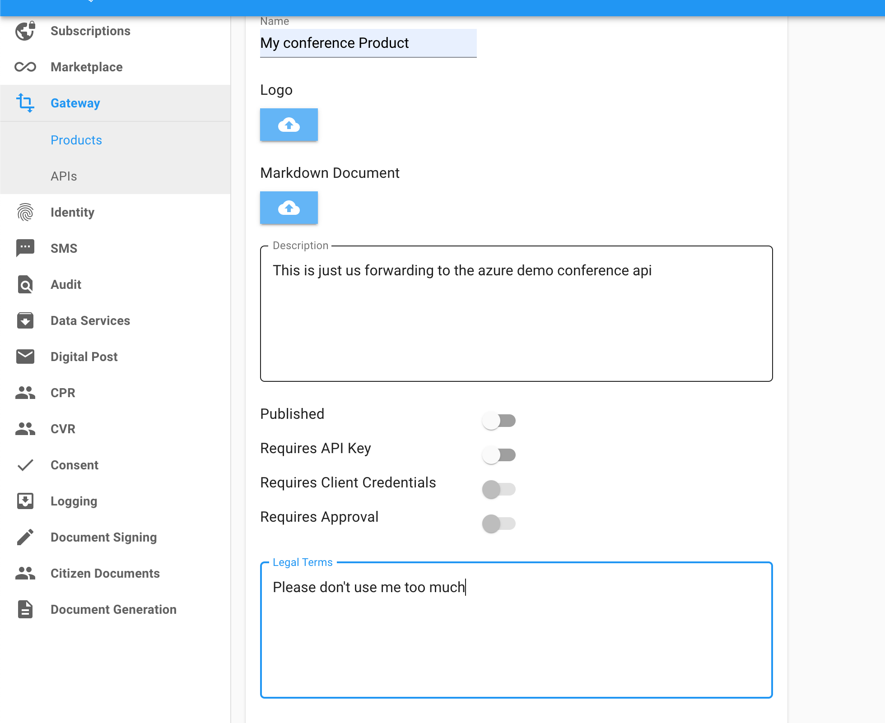
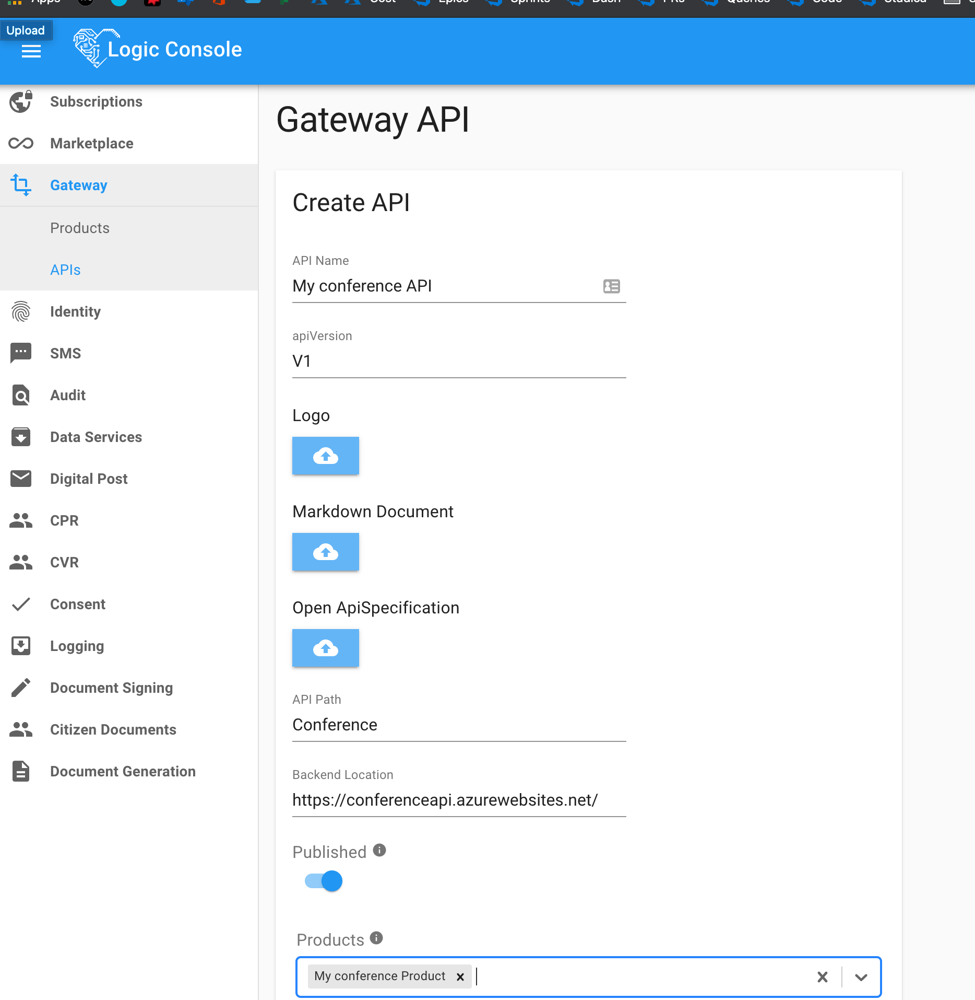
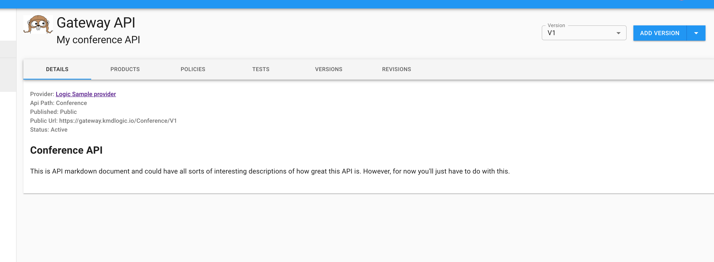

# Getting started as a provider on Logic Marketplace & Gateway

1. Create a subscription - and make sure to activate it.

    

    

1. Go to the marketplace and request to become a provider (wait for that to be approved). We will get a notification about the pending approval, but to speed up the process. The markdown will be shown on the provider main page so use it for introductory descriptions of your products and API's

    

1. Once the provider is approved, go to the products page and create a product.

    

1. Now it's time to create an API

    

That's it. Now if you go to the API page you'll be able to find your api and configure further, add policies, new version and revisions.

